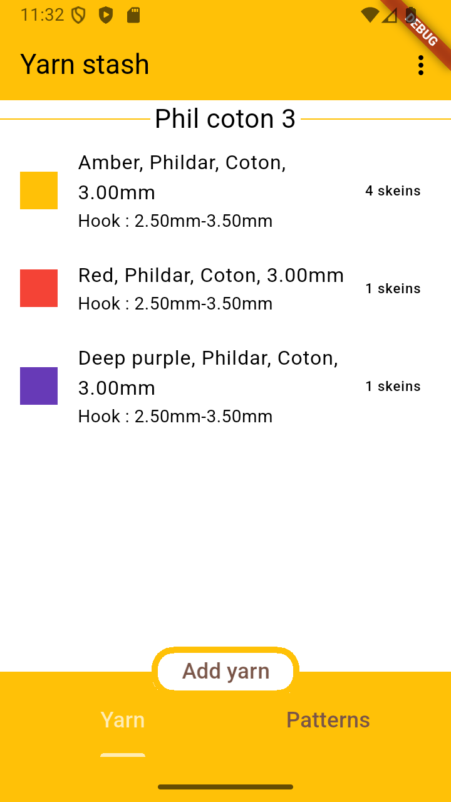
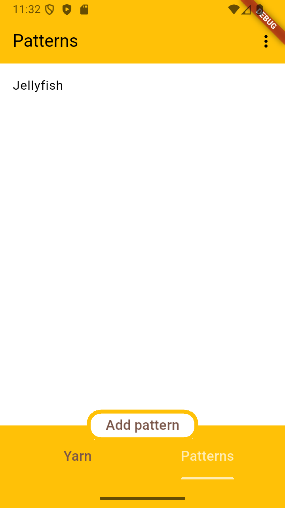
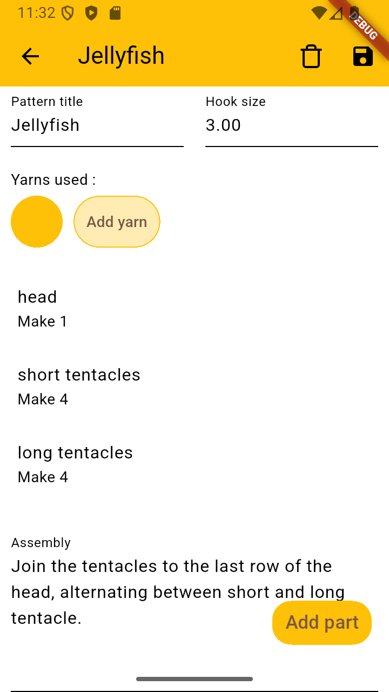
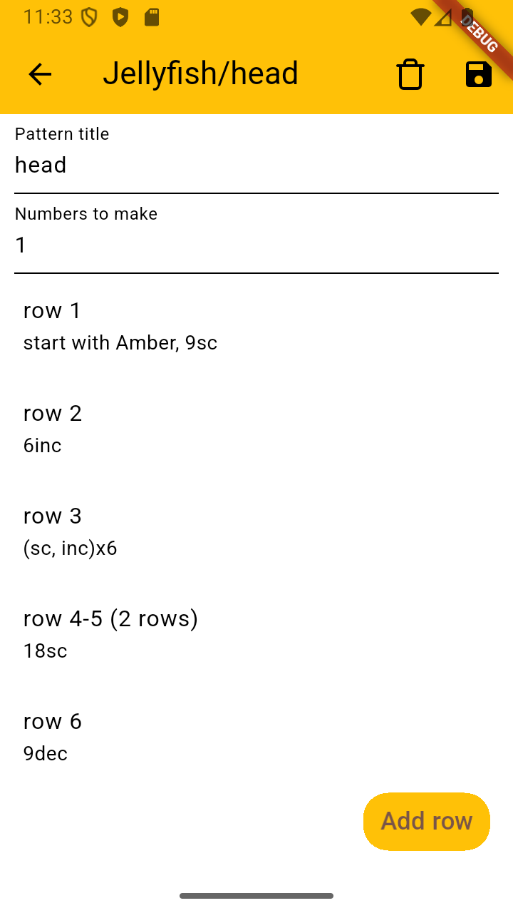
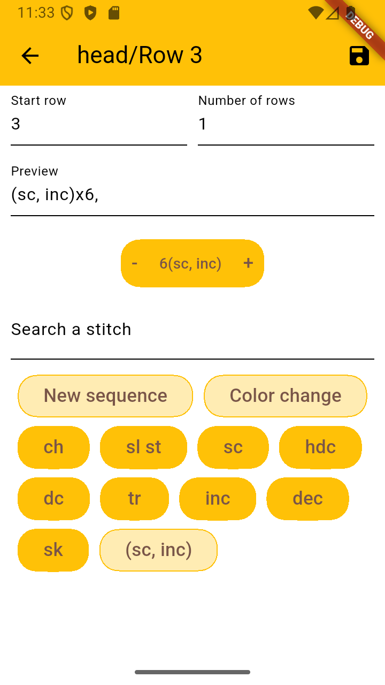
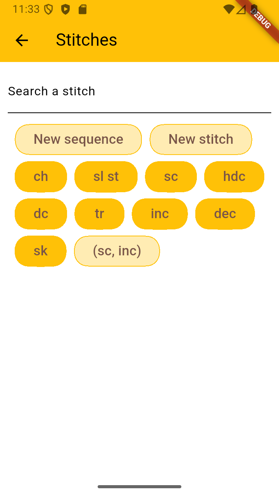
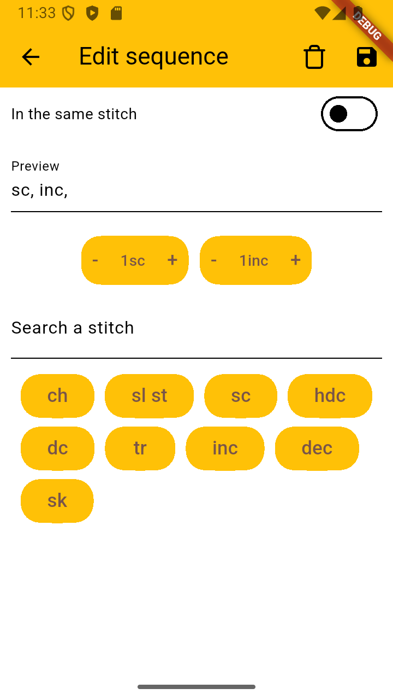

# CraftStash

Basic utility app to save crochet pattern and yarn info

## Features :
- Yarn :
  - Display stored yarn sorted by collection
  - Store unique yarn, containing info such as :
    - It's Color and color name
    - It's Brand
    - It's Material
    - It's Thickness
    - It's Minimum-Maximum hook size
    - The number of skein the user has
  - Store yarn collection, containing general info such as :
    - It's name
    - It's Brand
    - It's Material
    - It's Thickness
    - It's Minimum-Maximum hook size
  - Store yarn from a collection, containing info such as :
    - Every info from the yarn collection
    - It's color and color name
    - The number of skein the user has
    
- Pattern
  - Display stored pattern
  - Store the pattern title
  - Store the `yarns` and hook size used by the pattern
  - Store and display the `parts` of the pattern
  - Store the assembly description of the pattern
  
- Pattern parts
  - Store and display the `rows` of the part
  - Store the part name and how many times it needs to be made

- Part's rows
  - Store and display the row's number and how many times it needs to be repeated
  - Store and display the row's `details` 
  
- Row's details
  - Display the stitch they are connected to, 
  - Store how many time the details need to be repeated
  
- Stitch
  - Store the stitch abreviation and name
  
## Tech
  - Language : Dart
  - Framework : Flutter
  - important package used :
    - sqflite: ^2.4.2
    - flutter_colorpicker: ^1.1.0
    
### Preview : 

#### Yarn page

#### Pattern list and Patterm page

#### Pattern part page

#### Row page

#### Stitch page and Editing stitch sequence page

